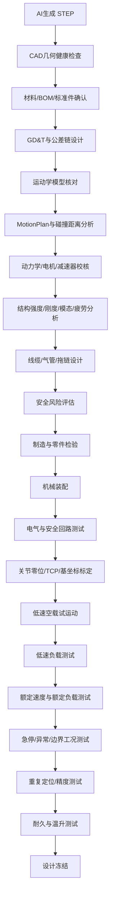

# AI生成STEP机器人经过MotionPlan与碰撞检测后的剩余风险与工程验证报告

## 执行摘要

**结论：仍然可能有很多问题，而且其中若干问题在 MotionPlan 和碰撞检测中原则上就发现不了。**

以下按“通用工业机器人装配”假设分析，即 STEP 文件描述的是多关节机器人/机械臂及其末端结构，已经建立运动学模型，并完成了至少一轮路径规划和刚体碰撞检测。若这些 STEP 几何主要由 AI 生成，则建议把它们视为**“未经工程签署的概念几何”**，而不是可直接投产的工程图样。

最关键的区别是：

> **MotionPlan 验证的是：“给定这个数字模型、给定这些约束，规划器能不能找到一条不发生模型碰撞的轨迹。”**  
> 它并没有自动证明：“STEP模型正确、零件能加工、能装起来、电机带得动、轴承扛得住、线缆不会断、机器人足够刚、控制器能跟踪、安全回路合规、急停不会撞人、长期运行不会失效。”

这是机器人设计中很容易出现的“**simulation-to-reality gap（仿真到实机差异）**”。以 OMPL/MoveIt 为例，OMPL 官方明确说明其本身并不包含碰撞检测代码，碰撞检测、运动学和模型加载由外部系统提供；MoveIt 的实际轨迹执行又依赖机器人特定控制器。因此规划结果的可靠性高度依赖机器人模型、碰撞模型、关节限制、控制器和环境模型是否真实。citeturn7search1turn8search2turn8search4

对于 AI 生成的 STEP，建议首先检查的是**设计意图是否存在**。STEP/AP242 可以表达几何、产品结构、属性、制造信息、配置管理等信息，但文件格式具备这些能力，并不意味着你的 STEP 实际包含正确的材料、公差、PMI、版本、质量属性和制造要求。ISO 当前页面显示 AP242 已更新到 ISO 10303-242:2025；NIST 对 STEP/PMI 交换长期进行验证，也说明“文件能打开”不能等同于数据完全正确传递。citeturn13search0turn3search0turn2search0

因此建议将当前状态理解为：

**STEP几何完成 → MotionPlan通过 → 仅意味着进入工程验证阶段，而不是设计完成。**

风险优先级可以概括为：

| 风险 | MotionPlan通常能否发现 | 实机风险 | 优先级 |
|---|---:|---:|---:|
| 刚体几何直接碰撞 | 能 | 高 | P0 |
| 关节轴/零位/限位定义错误 | 部分 | 极高 | P0 |
| 电机/减速器扭矩不足 | 通常不能 | 极高 | P0 |
| 结构强度、刚度、疲劳不足 | 不能 | 极高 | P0 |
| 公差导致装不上 | 不能 | 高 | P0 |
| 轴承/联轴器安装方式错误 | 不能 | 高 | P0 |
| 电缆拖链、线束被拉断/扭断 | 通常不能 | 高 | P0 |
| TCP/编码器/关节标定误差 | 通常不能 | 高 | P0 |
| 控制器跟踪误差导致实际碰撞 | 通常不能 | 高 | P0 |
| 急停后的制动距离 | 普通路径规划不能 | 极高 | P0 |
| EMC、接地、电气安全 | 不能 | 高 | P1 |
| 温升、润滑、长期寿命 | 不能 | 高 | P1 |
| 可制造性与维修性 | 不能 | 中高 | P1 |

ISO 10218-1:2025 与 ISO 10218-2:2025 已明确区分“机器人本体安全”与“机器人应用/机器人单元集成安全”，后者覆盖集成、调试、运行、维护和退役等过程；也就是说，即使机器人自身轨迹正确，完整机器人系统仍需单独进行风险评估与验证。citeturn1search9turn1search2

## 为什么MotionPlan与碰撞检测仍然不够

**首先是“你仿真的机器人可能并不是你最后造出来的机器人”。**

如果 AI 直接生成 STEP，它很容易得到视觉上合理、运动上也合理的零件，但没有真实的制造约束。例如两个孔中心在 CAD 中完全重合，并不能说明加工后仍能对齐；两个轴承在几何上恰好套入轴，并不能说明轴承内圈、外圈使用了合理的过盈/间隙配合；螺钉模型可以“放进去”，也不意味着有足够的螺纹啮合长度、沉孔深度、工具操作空间或可靠预紧力。工程图需要尺寸公差、几何公差、基准体系和配合关系。中国现行 GPS 标准体系包括 GB/T 1800 系列的孔轴公差配合和 GB/T 1182-2018 的几何公差标注。citeturn11search0turn11search1

因此最常见的 AI STEP 风险并不是“外形看起来不对”，而是：

**名义几何正确，但工程定义不存在。**

尤其要查轴承座、减速器输出法兰、电机定位止口、联轴器、定位销、轴肩、挡圈槽、螺纹、密封面这些位置。机器人末端机械接口可以参考 ISO 9409-1；值得注意的是，该标准本身也明确指出，接口尺寸标准化并不意味着负载能力自动得到保证，实际接口仍需按机器人负载能力和应用条件选择。citeturn10search10

其次，**运动学正确不等于动力学正确**。

MotionPlan往往主要解决：

\[
q(t)\rightarrow \text{是否满足关节约束、是否碰撞}
\]

真正机器人还必须满足：

\[
\tau = M(q)\ddot q+C(q,\dot q)\dot q+G(q)+\tau_{friction}+\tau_{payload}
\]

也就是说，同一条“没有碰撞”的轨迹，在末端没有负载时可能完全正常，装上10 kg夹具以后，J2/J3轴可能已经超过减速器瞬时扭矩；速度降低时可能正常，高加速度运行时却会驱动报警。ISO 9283/GB/T 12642关注工业机器人的位姿准确度、重复定位等性能指标，这些指标最终需要在真实机器人上验证，而不能仅由几何运动规划推出。citeturn1search5turn6search0

尤其需要重新建立一套真实动力学参数：

| 参数 | STEP通常是否可靠提供 | 需要如何验证 |
|---|---|---|
| 每个Link质量 | 不一定 | CAD材料+实物称重 |
| 质心 | 不一定 | CAD质量属性/摆锤法 |
| 转动惯量 | 通常不能直接信 | CAD质量属性+动力学辨识 |
| 减速比 | 几何不能保证 | BOM/供应商规格 |
| 传动效率 | 没有 | 供应商曲线/实验 |
| 齿隙 | 没有 | 正反向测量 |
| 摩擦 | 没有 | 电流-速度辨识 |
| 轴承摩擦 | 没有 | 样机测量 |
| 电机Kt/Ke | 没有 | 厂商规格/测试 |
| 连续/峰值转矩 | 没有 | 电机、驱动、减速器三者共同校核 |

由此建议至少做三种工况：**最大静态重力工况、最大加减速工况、急停/异常制动工况**。任何关节都应同时检查电机峰值转矩、RMS转矩、驱动器电流以及减速器允许输入/输出转矩，而不是只检查电机功率。

第三，**机器人会变形，而碰撞模型通常不会。**

长臂结构、薄壁铝件、3D打印件、减速器输出端、轴承和末端执行器都会产生弹性变形。如果数字模型中两个零件之间有2 mm间隙，而结构最大负载下挠度为1 mm、定位误差0.5 mm、制造误差0.4 mm，再考虑温度和线缆摆动，那么这条“无碰撞轨迹”在实机可能已经没有裕度。工业机器人的最终性能因此需要实际测试，而不是只看名义CAD。citeturn6search0turn9search1

工程上建议把碰撞余量写成：

\[
C_{min}>
E_{manufacturing}
+E_{assembly}
+E_{calibration}
+E_{tracking}
+D_{elastic}
+D_{thermal}
+E_{model}
+M_{safety}
\]

而不是简单采用：

\[
C_{min}>0
\]

这是你目前最值得修改 MotionPlan 的地方：**不要只测“碰不碰”，而应该测“最小距离还有多少”。**

第四，**线缆、气管和拖链是机器人仿真中最大的漏项之一。**

STEP中即使画了线缆，也往往只是某一个静态姿态。实际运动中会发生弯曲、扭转、甩动以及与壳体摩擦。典型故障不是刚性Link相撞，而是J4/J5/J6旋转时EtherCAT线、编码器线、气管或末端动力线逐渐绕紧；运动规划对此通常没有建模。真实轨迹执行本身也由实际控制器完成，MoveIt 官方文档明确将规划与机器人特定的控制器接口分开处理。citeturn8search2turn8search14

建议把线束单独作为一个子系统验证：

**J1—Jn逐轴全行程 → 两轴组合运动 → 最坏姿态 → 连续循环。**

验收至少满足：

线缆无拉伸到极限、无夹点、无锐边摩擦；最小弯曲半径满足电缆厂家要求；旋转轴的累计扭转在规格内；连接器不承担线束拉力；拖链内保留合理运动空间。

第五，**MotionPlan中的关节轴很可能与真实机械轴不完全一致。**

这对 AI STEP 尤其危险。例如CAD中两根轴线看起来共线，但是轴承座公差、装配基准、减速器止口、联轴器偏心会导致实际轴线偏差；而URDF/SRDF中joint origin或axis哪怕只有小偏差，也会在长机械臂末端放大。

还需要核查：

**Joint axis → reducer axis → bearing axis → encoder zero → controller zero → URDF zero → TCP**

是不是同一套定义。

ISO机器人标准体系专门规定机器人坐标系和运动命名，而性能标准又要求最终验证机器人实际位姿性能；因此“STEP轴线正确”不能替代机械标定和TCP标定。citeturn10search5turn1search5

第六，**实际控制器执行的轨迹并不完全等于规划轨迹。**

运动规划可能生成若干waypoint，随后还要经过时间参数化、控制器插补、伺服跟踪以及机械传动。MoveIt文档本身就包含起始位置容差、轨迹执行时间监测等参数，而且控制器接口是机器人相关的，这说明“规划成功”和“准确执行”是两个不同阶段。citeturn8search4turn8search8

因此建议记录：

\[
e_q(t)=q_{command}(t)-q_{actual}(t)
\]

以及：

\[
e_{TCP}(t)=TCP_{command}(t)-TCP_{actual}(t)
\]

特别检查高速拐角、方向反转、重载水平伸展和急减速位置。

## 主要剩余风险与工程检查方法

下面这张表可以直接作为当前 STEP 文件的第一轮 Design Review 清单。

| 类别 | 必须检查的问题 | 推荐工具/方法 | 建议验收门槛 |
|---|---|---|---|
| **机械几何** | STEP是否有坏面、重复体、自交、小碎面、穿透 | CAD Geometry Check、STEP重新导入 | solid body全部有效；无意外干涉 |
| **尺寸公差** | 轴承孔、轴、销孔、法兰是否只有名义尺寸 | GD&T审查、GB/T 1800、GB/T 1182 | 所有关键配合都有公差和基准 citeturn11search0turn11search1 |
| **装配** | 是否存在“CAD能放进去但工具装不了” | Digital Mock-Up、实物样机 | 螺栓/扳手/拉马等均有操作空间 |
| **运动学** | joint axis、zero、limit、direction是否真实 | URDF—CAD自动/人工比对 | CAD/URDF/控制器逐轴一致 |
| **碰撞** | 是否只做名义零间隙碰撞 | Minimum-distance sweep | 最小间距大于误差预算总和 |
| **结构** | Link、法兰、轴、螺栓强度是否足够 | FEA+手算 | 最大应力/变形满足设计规范 |
| **刚度** | 末端重载时下垂多少 | FEA+百分表/激光跟踪仪 | TCP偏移低于产品精度预算 |
| **模态** | 机械臂是否有低频共振 | Modal FEA、加速度计 | 工作激励频率避开主要共振区 |
| **电机** | 最大姿态是否过载 | 逆动力学、电流记录 | 峰值/RMS均低于允许额定 |
| **减速器** | 瞬时转矩、寿命、输出轴承 | 厂商寿命计算 | 满足设计工作循环 |
| **轴承** | 配合、公差、预紧、受力方向 | 轴承计算+装配测量 | 寿命和温升满足设计值 |
| **线缆** | 拉伸、扭转、弯曲、摩擦 | 全行程慢速录像、拖链测试 | 全工作空间无夹伤/过弯 |
| **热** | 电机/减速器/驱动长期温升 | 热电偶、热像仪 | 稳态温度低于器件允许值 |
| **标定** | TCP、关节零位、基坐标误差 | 激光跟踪仪/CMM/标定板 | 达到产品声明精度 |
| **重复定位** | 仿真精度是否能在实机重复 | ISO 9283/GB/T12642测试 | 达到产品规格 citeturn1search5turn6search0 |
| **电气** | PE接地、绝缘、屏蔽、EMC | 接地测试、绝缘表、EMC测试 | 按GB/T 5226.1及相关标准验证 citeturn0search7turn10search2 |
| **安全** | 急停、保护停止、门锁、安全限速 | 安全验证+停止距离测试 | 安全功能达到风险评估确定的PLr citeturn13search1turn1search2 |
| **软件** | AI模型、URDF、参数、固件是否版本对应 | Git/PLM/hash | 每台机器人可追溯到唯一配置 |

这里尤其建议做一个**STEP Round-trip Test**：

原AI STEP → CAD A导入 → 保存/再导出STEP → CAD B导入 → 比较原模型与最终模型的体积、表面积、质心、包围盒和装配树。

NIST针对CAD/STEP/PMI互操作性开展过专门的验证工作，因此对关键机械产品，不宜把“一款软件能正常显示模型”当作数据完整性的充分证明。citeturn2search0turn2search2

对于AI模型，我会再加一项传统CAD通常没这么强调的检查：**BOM真实性审计**。所有轴承、电机、减速器、联轴器、螺钉、密封件、连接器都必须由真实可采购型号重新替换和确认。AI画出的“看起来像M6螺钉”“看起来像谐波减速器”不能作为工程依据。

## 建议验证流程与验收门槛

建议不要从“MotionPlan已经通过”直接进入加工，而是增加如下V模型式验证流程：

其中有几个“Gate”非常重要。

**几何Gate：**所有零件都是有效实体；关键配合完成GD&T；装配无静态干涉；所有标准件都有真实型号；STEP导入导出后的质量属性差异需要设企业内部阈值，关键零件原则上应做到无不可解释变化。STEP/AP242本身支持更丰富的产品定义信息，因此有条件时应保留PMI而不是只交付“裸几何”。citeturn3search0turn13search0

**动力学Gate：**在最大负载、最差重心位置以及最大加减速运动下，所有关节的峰值转矩、电流和RMS负荷均不得超过电机、驱动器和减速器相应限制；同时验证制动器保持能力。不要用“额定功率足够”代替完整关节负载计算。

**结构Gate：**至少做最大静态负载、最大动态负载、异常停止工况。除了应力，还必须看末端位移；对高精度机器人，很多情况下真正首先造成性能问题的不是“零件断裂”，而是结构变形使TCP精度失效。

**标定Gate：**在实机上建立机械零位→编码器零位→控制器零位→模型零位映射，然后重新测量机器人基坐标与TCP。最终的位姿精度和重复定位应依据GB/T 12642/ISO 9283或产品技术规范进行验证，而不能拿仿真结果直接作为精度验收。citeturn6search0turn1search5

**安全Gate：**不要只测试“急停按钮有没有让程序停止”，而应测量实际停止时间和停止距离，并把制动距离纳入安全空间。ISO 10218-2:2025覆盖机器人应用和机器人单元的设计、集成、调试、运行与维护；ISO 13849-1:2023则给出了安全相关控制系统及其软件的设计方法。citeturn1search2turn13search1

中国标准方面，截至2026年9月，全国标准信息公共服务平台仍列有GB 11291.1-2011、GB 11291.2-2013，同时已经存在新的强制性国家标准项目“20262542-Q-339 工业机器人安全要求 第1部分：整机”和“20262543-Q-339 工业机器人安全要求 第2部分：应用与单元”。因此做2026年以后的新产品设计时，建议同时跟踪国内新项目和ISO 10218:2025，避免产品设计冻结后很快面临标准切换。citeturn5search2turn5search1

## 不同机器人场景需要额外调整的项目

以上默认的是**通用工业机器人**。如果你的AI STEP对应的机器人不是传统固定式机械臂，需要增加额外验证。

**协作机器人：**碰撞检测只能避免机器人碰到环境，却不能证明“机器人碰到人时是安全的”。需额外考虑接触力、压力、速度、有效质量、夹持点和人体部位等问题。ISO/TS 15066仍在ISO机器人标准体系中，同时ISO/PAS 5672给出了协作应用中人体接触力和压力测试方法；中国也在制定相关接触力测试方法。citeturn10search5turn9search7

**移动机器人/AMR+机械臂：**不能只分析机械臂自身，需要把底盘定位误差、地面坡度、制动距离、轮胎/脚轮变形以及上装机械臂运动引起的重心转移加入模型。中国已有GB/T 40327-2021轮式移动机器人导引运动性能测试方法；物流机器人电气安全标准GB/T 47494-2026已发布，将于2026年11月1日实施。citeturn9search6turn5search3

**人形/腿式机器人：**MotionPlan的无碰撞意义更有限，因为系统还需要满足动态稳定、足底接触、ZMP/质心、跌倒、冲击、驱动热管理等条件。ISO TC299当前已经开展动态稳定工业移动机器人及人形机器人相关新标准项目，中国也在快速建立人形机器人标准体系。citeturn10search5turn9search8

**特种机器人：**水下、军用、医疗、核环境、防爆等不能直接套用ISO 10218。ISO 10218-1和10218-2明确列出了若干不在其适用范围内的场景，因此需要重新确定行业专用标准体系。citeturn1search9turn1search2

从工程决策角度，可以使用一个很简单的判断原则：

> **只要某个参数在你的MotionPlan输入模型里不存在，那么MotionPlan就没有验证这个参数。**

因此建议现在直接打开你的仿真模型，逐项确认是否真实输入了：**质量、质心、惯量、扭矩限制、速度限制、加速度限制、jerk限制、真实Joint zero、关节齿隙、结构弹性、TCP误差、线缆包络、制造公差、控制跟踪误差、急停制动距离。**

如果其中一大半没有，那么当前结果应该定义为：

**“运动学概念验证通过”**

而不是：

**“机器人设计验证通过”。**

## 参考资料与标准

以下资料可以作为你下一阶段从“AI STEP + MotionPlan”走向工程样机的核心参考体系。中文国家标准优先列出；部分标准全文可能需要通过标准服务平台、企业标准库或正规出版渠道获取。

| 标准/资料 | 适用范围与建议用途 |
|---|---|
| **GB/T 12642-2013《工业机器人 性能规范及其试验方法》** citeturn6search0 | 最重要的实机性能验证参考之一；关注位姿准确度、重复定位等，建议作为样机最终性能测试依据。 |
| **GB/T 20868-2024《工业机器人性能试验应用规范》** citeturn5search0 | 对工业机器人性能试验实施方式进一步规范，适合制定企业FAT测试程序。 |
| **GB 11291.1-2011《工业环境用机器人 安全要求 第1部分：机器人》** citeturn5search2 | 当前中国工业机器人本体安全的重要基础标准，同时关注其后续替代项目。 |
| **GB 11291.2-2013《机器人与机器人装备 工业机器人的安全要求 第2部分：机器人系统与集成》** citeturn5search1turn5search2 | 机器人单元、围栏、集成、安全功能设计的重要参考。 |
| **GB/T 20867.1-2024《机器人 安全要求应用规范 第1部分：工业机器人》** citeturn5search2 | 中国工业机器人安全要求实施和应用参考。 |
| **GB/T 16855.1-2025《机械安全 安全控制系统 第1部分：设计通则》** citeturn12search0 | 急停、保护停止、安全门、STO等安全功能进行安全控制系统设计的重要依据。 |
| **GB/T 5226.1-2019《机械电气安全 机械电气设备 第1部分：通用技术条件》** citeturn0search7 | 接地、保护联结、绝缘、机械电气设备设计和验证。 |
| **GB/T 1800.1/1800.2-2020 产品几何技术规范—线性尺寸公差ISO代号体系** citeturn11search0 | 轴、孔、轴承座、销定位、电机止口等配合设计，是AI裸STEP转工程图的必备标准。 |
| **GB/T 1182-2018《产品几何技术规范（GPS） 几何公差》** citeturn11search1turn11search5 | 同轴度相关控制、位置、方向、跳动、基准等机械精度设计。 |
| **GB/T 1958-2017《产品几何技术规范（GPS） 几何公差 检测与验证》** citeturn11search9 | 把CAD/GD&T要求转换成实物检验方案。 |
| **GB/Z 43065.1-2023《机器人 工业机器人系统的安全设计 第1部分：末端执行器》** citeturn5search2 | AI生成夹爪、工具法兰、末端执行器时尤其值得使用。 |
| **GB/Z 43065.2-2023《机器人 工业机器人系统的安全设计 第2部分：手动装载/卸载工作站》** citeturn5search1 | 人工上下料、机器人工作站和人工交互区安全设计。 |
| **GB/T 38326、GB/T 38336 工业、科学和医疗机器人电磁兼容系列** citeturn10search2turn10search4 | EMI/EMS、电机驱动、编码器、通信异常等电气问题验证。 |
| **ISO 10218-1:2025《Robotics — Safety requirements — Part 1: Industrial robots》** citeturn1search9 | 当前国际工业机器人本体安全核心标准。 |
| **ISO 10218-2:2025《Robotics — Safety requirements — Part 2: Industrial robot applications and robot cells》** citeturn1search2 | 当前机器人应用与机器人工作单元集成安全核心标准。 |
| **ISO 13849-1:2023《Safety of machinery — Safety-related parts of control systems》** citeturn13search1 | 安全相关控制系统、Performance Level和软件安全设计。 |
| **ISO 12100:2010《Safety of machinery — Risk assessment and risk reduction》** citeturn13search2 | 建立整机风险分析/FMEA/风险降低流程的基础标准；ISO目前同时有其后续修订项目。citeturn13search16 |
| **ISO 9283:1998《Manipulating industrial robots — Performance criteria and related test methods》** citeturn1search5 | 工业机器人精度和性能测试的国际基础。 |
| **ISO 9409-1:2004《Manipulating industrial robots — Mechanical interfaces — Plates》** citeturn10search10 | 末端机械法兰接口设计，非常适合审查AI生成法兰结构。 |
| **ISO 10303-242:2025 STEP AP242** citeturn13search0 | STEP不仅用于交换几何，也面向模型化3D工程、产品数据、配置和制造信息；适合建立正式MBD数据流程。 |
| **NIST CAD/STEP/PMI验证资料** citeturn2search0turn2search2 | 很适合解决“这个STEP虽然能打开，但数据究竟有没有丢”的问题。 |
| **OMPL官方文档** citeturn7search1 | 理解Motion Planning算法的边界：规划器、碰撞检测器、运动学模型不是同一层。 |
| **MoveIt官方Trajectory Execution / Controller文档** citeturn8search2turn8search4 | 理解“规划轨迹”与“真实控制器执行轨迹”之间的差异。 |

最后给出一个最实用的工程判断：

**假如现在只能额外做五件事，优先顺序应当是：**

**STEP/GD&T工程化审查 → 电机/减速器动力学校核 → 结构刚强度分析 → 线缆与真实控制器全行程测试 → 实机安全与精度验证。**

其中任何一项失败，都可能出现一种典型情况：**MotionPlan里非常漂亮，碰撞检测全部绿色，但第一台样机仍然装不上、带不动、抖动、过热、定位不准、断线，甚至在急停时发生碰撞。** ISO 10218、ISO 12100和ISO 13849采用的系统安全思路，本质上也正是避免把“正常条件下能运行”误当成“完整生命周期内已经安全”。citeturn1search2turn13search2turn13search1